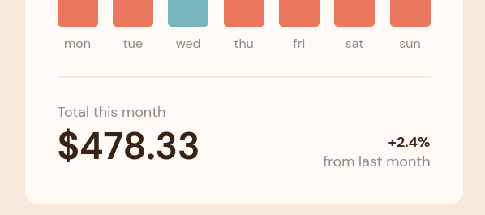
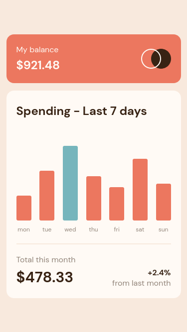

# Frontend Mentor - Expenses chart component solution

This is a solution to the [Expenses chart component challenge on Frontend Mentor](https://www.frontendmentor.io/challenges/expenses-chart-component-e7yJBUdjwt). Frontend Mentor challenges help you improve your coding skills by building realistic projects. 

## Table of contents

- [Overview](#overview)
  - [The challenge](#the-challenge)
  - [Screenshot](#screenshot)
  - [Links](#links)
- [My process](#my-process)
  - [Built with](#built-with)
  - [What I learned](#what-i-learned)
  - [Continued development](#continued-development)
  - [Useful resources](#useful-resources)
- [Author](#author)
- [Acknowledgments](#acknowledgments)

**Note: Delete this note and update the table of contents based on what sections you keep.**

## Overview

### The challenge

Users should be able to:

- View the bar chart and hover over the individual bars to see the correct amounts for each day
- See the current day’s bar highlighted in a different colour to the other bars
- View the optimal layout for the content depending on their device’s screen size
- See hover states for all interactive elements on the page
- **Bonus**: Use the JSON data file provided to dynamically size the bars on the chart

### Screenshot

#### Dekstop



#### Mobile



### Links

- [Solution URL](https://stijnvdw.github.io/frontend-mentor-expenses-chart-component-main/)
- [Site URL](https://stijnvdw.github.io/frontend-mentor-expenses-chart-component-main/)


### Built with

- Semantic HTML5 markup
- CSS custom properties
- Flexbox
- Mobile-first workflow

### What I learned

#### Creating a logo

It was hard to create the logo with two circles. Sizes of both circles didn't match when using a simple border and filling of circle.

```css
.circleBorder {
    width: 40px;
    height: 40px;
    border-radius: 40px;
    outline: 2px solid var(--clr-neutral-very-pale-orange);
    outline-offset: -2px;
    background-color: transparent;
    z-index: 1;
}

.circleFull {
    margin-left: -20px;
    width: 40px;
    height: 40px;
    border-radius: 40px;
    background-color: var(--clr-neutral-dark-brown);
    z-index: 0;
}
```

#### Tooltip

First attempt I used an flex item which I hid but it took up space in the DOM. Ended up with a different approach positioning the tooltip relative. Next up was a problem with the oppacity from the parent being applied. To fix this I had to seperate both the coloring and tooltip.

### Useful resources

#### Creating a logo

- [CSS Inner border](https://www.delftstack.com/howto/css/css-inner-border/)
- [Stacking elements](https://css-tricks.com/how-to-stack-elements-in-css/)
- [CSS Flexbox](https://www.w3schools.com/csS/css3_flexbox_items.asp)


### Tooltip reading

- [CSS Tooltip](https://www.w3schools.com/css/css_tooltip.asp)
- [CSS Tooltip example code](https://jsfiddle.net/Krxldfx/ao3hjh0r/)
- [CSS Transparency](https://css-tricks.com/non-transparent-elements-inside-transparent-elements/)
- [CSS Hide element](https://www.sitepoint.com/hide-elements-in-css/)

## Author

- Frontend Mentor - [@StijnvdW](https://www.frontendmentor.io/profile/StijnvdW)

